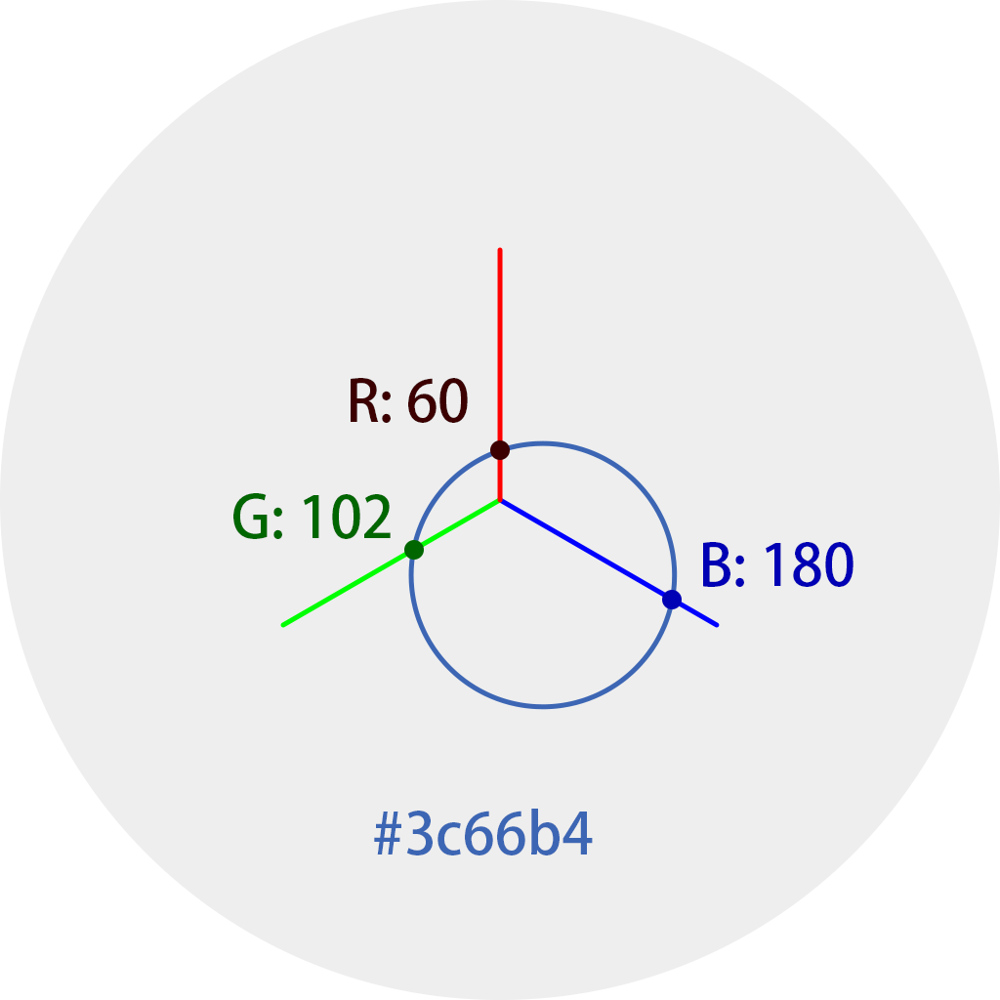

# Colors

This is a small collaborative project about favorite colors, the results are the calculated average of every color chosen by the participants. Colors are recorded in Hex color code, converted into decimal integers for calculation, and converted back to Hex code.

This visualization of results is designed to represent each entry on the same chart. The circular chart has three axes – Red, Green, Blue – set on its 0°, 120°, and 240° angles. By positioning the decimal values (0~255) on each axis, every color will have 3 corresponding coordinates on this 2D canvas, which are connected by a circle. Pure R/G/B colors with two 0 values are represented by line segments on the axes; and black is shown as a dot in the center.

    
    

Figures above show an intuitive but __inaccurate__ representation of the chart and how a color is placed on the chart.
